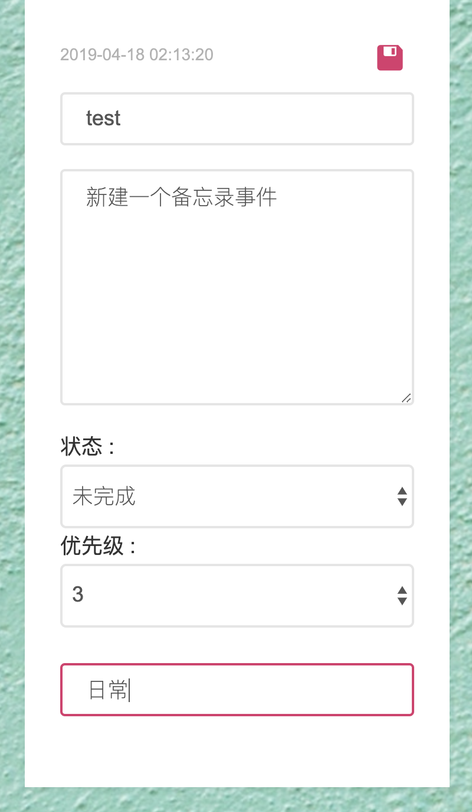
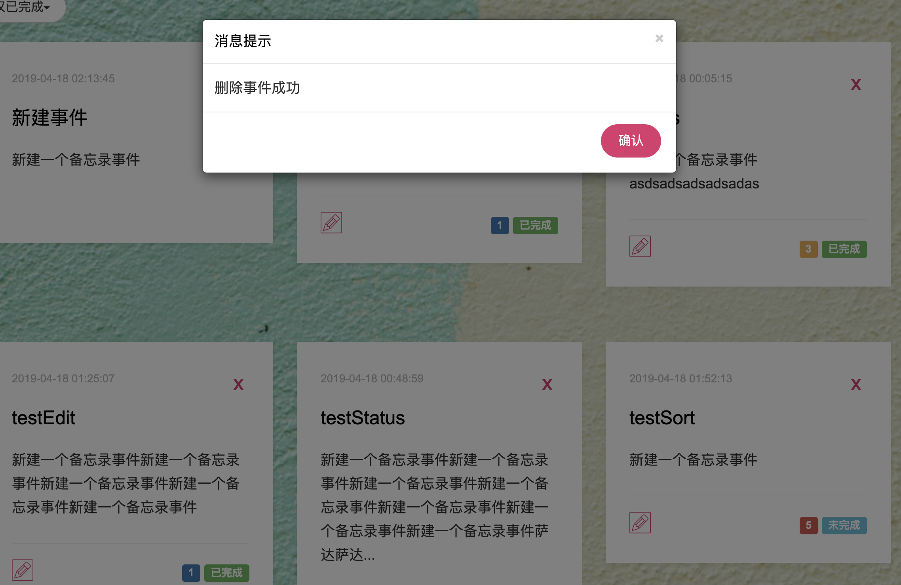
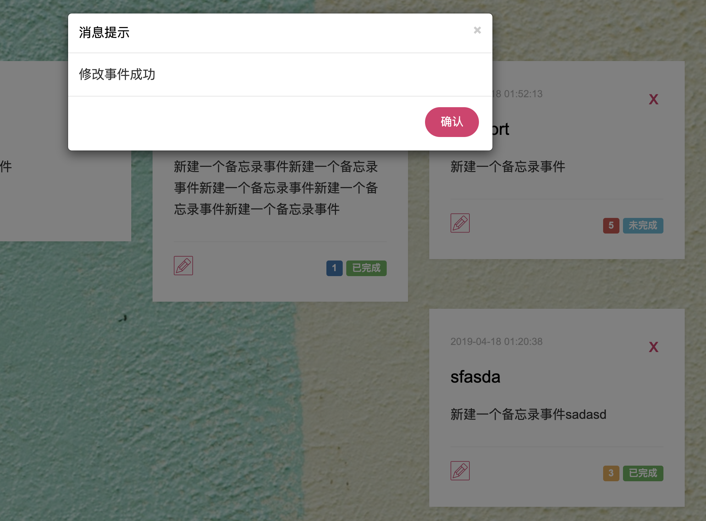
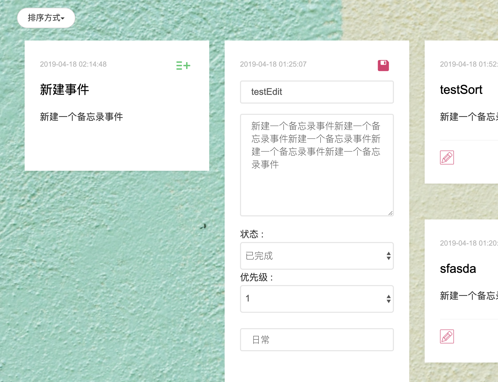
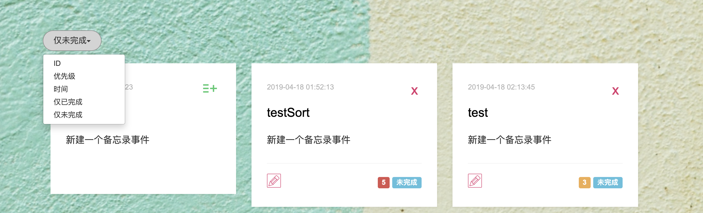
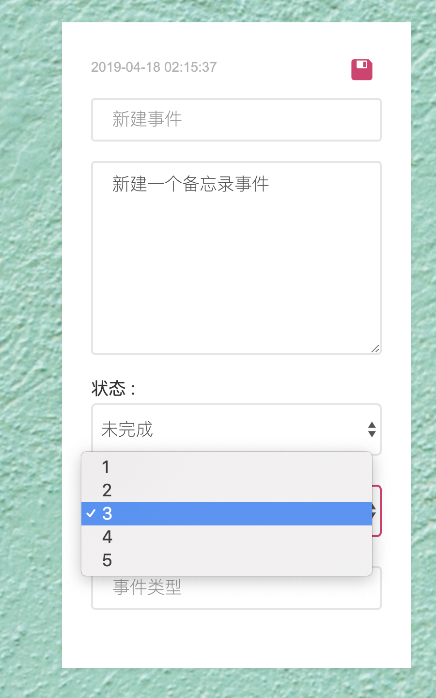

### 架构 Architecture

- PostgreSQL

- Django rest framework
- React

### 已实现功能 Feature List

- 增加一个待办事项 Add a new todo

- 删除一个待办事项 Delete a todo

- 标记一个待办事项为已完成 Mark a todo as finished

- 编辑一个待办事项的具体内容 Edit the content of a todo.

- 列出所有的待办事项 List all todos

- 待办事项可以设置优先级 Update the priority of a todo.

